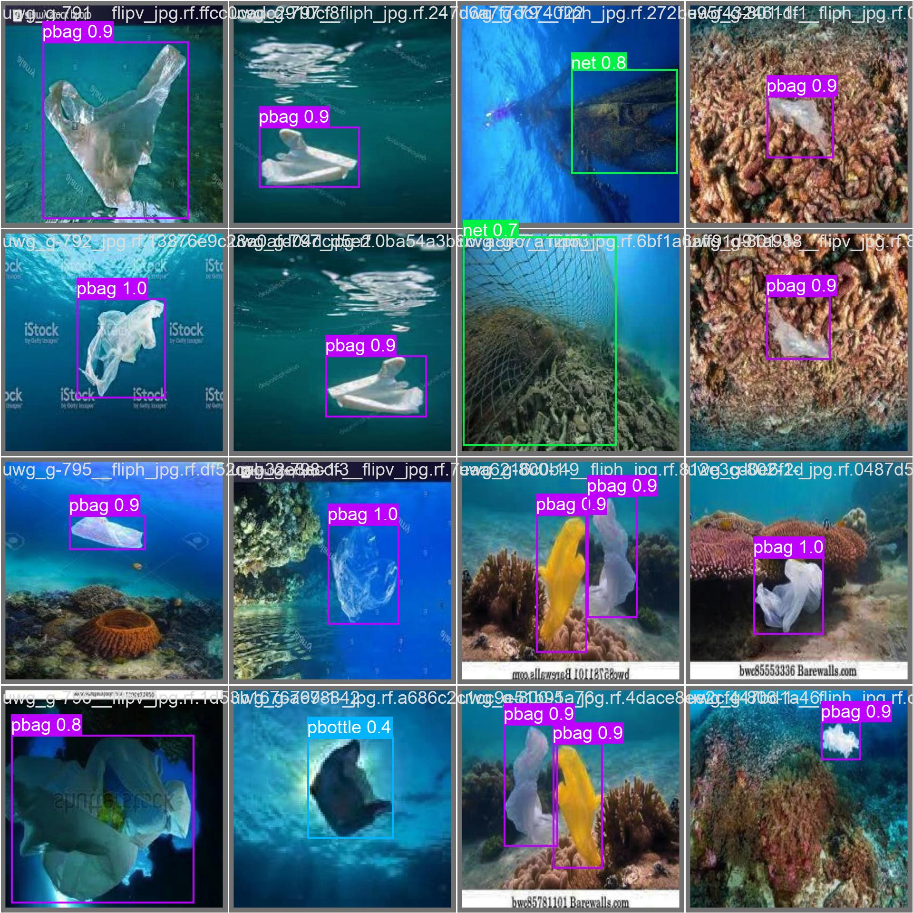

#### 資訊工程學系(1131)
# 智慧多媒體設計與創作實驗(B4CS040007A)

## 1. Realtime Object Detection Using YOLOv8n 
- 開啟攝影機，使用程式擷取攝影機的畫面  
- 將第一個 Frame，使用 YOLOv8 進行物件偵測與辨識  
- 將所偵測的物件座標點傳給追蹤器  
- 進行物件追蹤  
- 生成一個影片包含物件追蹤的結果  

<br>

- Turn on the camera and use a program to capture the camera feed.
- Use YOLOv8 to perform object detection and recognition on the first frame.
- Send the detected object coordinates to the tracker.
- Perform object tracking.
- Generate a video containing the results of object tracking.
### Environments
```
conda create --name object_detection python=3.8 -y
conda activate object_detection

# install packages
pip install ultralytics

pip uninstall opencv-python
pip install opencv-contrib-python
```

## 2. Object Detection Using YOLOv10m
Underwater Plastic Pollution Detection Dataset : [[Kaggle]](https://www.kaggle.com/datasets/arnavs19/underwater-plastic-pollution-detection)
- Train Directory:  
  - Contains 3,628 images along with their associated labels.  
- Valid Directory:  
  - Comprises 1,001 images paired with their respective labels.  
- Test Directory:  
  - Encompasses 501 images along with their labels.  
- Number of Class : 15  
  - Class Names - ['Mask', 'can', 'cellphone', 'electronics', 'gbottle', 'glove', 'metal', 'misc', 'net', 'pbag', 'pbottle', 'plastic', 'rod', 'sunglasses', 'tire']  

### Environments
```
conda create --name object_detection python=3.8 -y
conda activate object_detection

# install packages
pip install -q ultralytics
sudo apt install -q tree
```

### Results
```
Result after training 20 epochs

precision(B)        : 65.012 %
metrics/recall(B)   : 48.160 %
metrics/mAP50(B)    : 56.004 %
metrics/mAP50-95(B) : 38.722 %
```


  
<p align="center"></p> 
