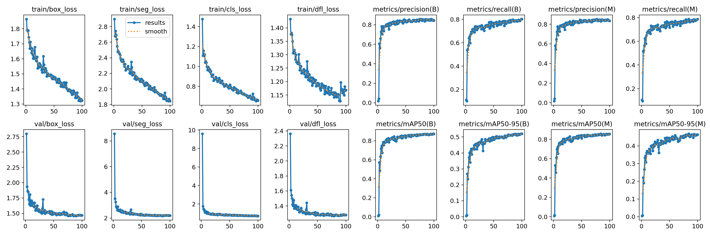
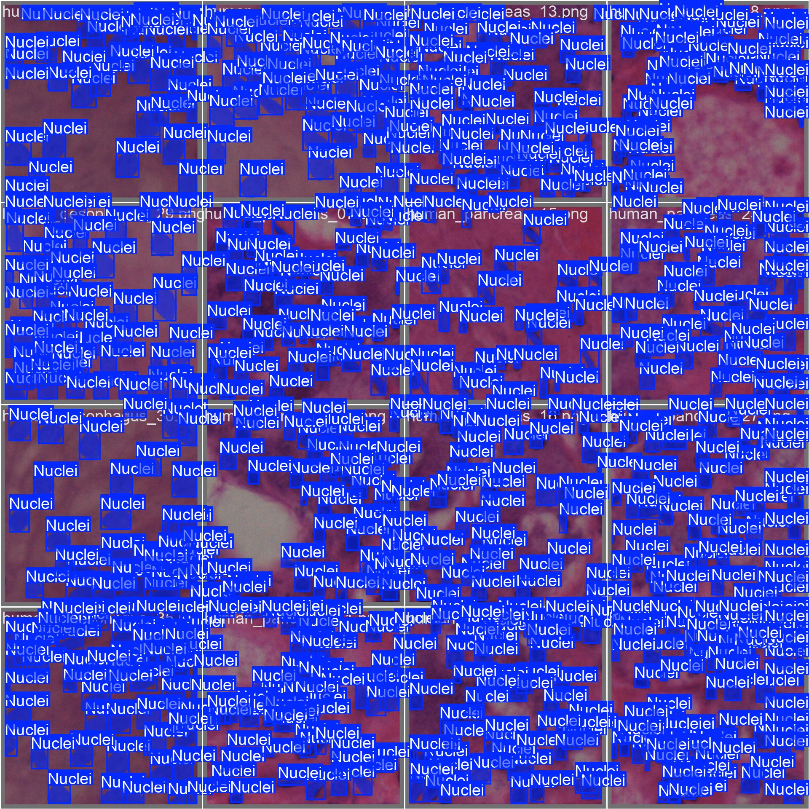

#### 資訊工程學系(1131)
# 智慧多媒體設計與創作實驗(B4CS040007A)  
> 1. [Realtime Object Detection Using YOLOv8n](https://github.com/Anguschen1011/YOLO_Project/blob/main/README.md#1-realtime-object-detection-using-yolov8n)  
> 2. [Object Segmentation Using YOLOv9c](https://github.com/Anguschen1011/YOLO_Project/tree/main?tab=readme-ov-file#2-object-segmentation-using-yolov9c)  
> 3. [Object Detection Using YOLOv10m](https://github.com/Anguschen1011/YOLO_Project/tree/main?tab=readme-ov-file#3-object-detection-using-yolov10m)

## 1. Realtime Object Detection Using YOLOv8n 
- 開啟攝影機，使用程式擷取攝影機的畫面  
- 將第一個 Frame，使用 YOLOv8 進行物件偵測與辨識  
- 將所偵測的物件座標點傳給追蹤器  
- 進行物件追蹤  
- 生成一個影片包含物件追蹤的結果  

<br>

- Turn on the camera and use a program to capture the camera feed.
- Use YOLOv8 to perform object detection and recognition on the first frame.
- Send the detected object coordinates to the tracker.
- Perform object tracking.
- Generate a video containing the results of object tracking.
### Environments
```
conda create --name object_detection python=3.8 -y
conda activate object_detection

# install packages
pip install ultralytics

pip uninstall opencv-python
pip install opencv-contrib-python
```
```
Realtime_object_detection/object_detectio.py
```
### Results
 

## 2. Object Segmentation Using YOLOv9c
NuInsSeg Dataset : [[Kaggle]](https://www.kaggle.com/datasets/ipateam/nuinsseg/data)
- contains more than 30k manually segmented nuclei from 31 human and mouse organs and 665 image patches extracted from H&E-stained whole slide images.  

### Environments
```
conda create --name object_detection python=3.8 -y
conda activate object_detection

# install packages
pip install ultralytics 
pip install pycocotools 
pip install scikit-learn 
pip install matplotlib
```
```
Nuclei_Instance_Segmentation/Yolov9c_segmentation.ipynb
```

### Results
```
Result after training 100 epochs.
Training on Colab T4 GPU

Box:
P        : 84.8 %
R        : 79.6 %
mAP50    : 87.2 %
mAP50-95 : 51.9 %

Mask:
P        : 83.9 %
R        : 78.3 %
mAP50    : 85.6 %
mAP50-95 : 46.5 %
```


  
<p align="center"><i> Label Data </i></p> 

  
<p align="center"><i> Predict Data </i></p> 

## 3. Object Detection Using YOLOv10m
Underwater Plastic Pollution Detection Dataset : [[Kaggle]](https://www.kaggle.com/datasets/arnavs19/underwater-plastic-pollution-detection)
- Train Directory:  
  - Contains 3,628 images along with their associated labels.  
- Valid Directory:  
  - Comprises 1,001 images paired with their respective labels.  
- Test Directory:  
  - Encompasses 501 images along with their labels.  
- Number of Class : 15  
  - Class Names - ['Mask', 'can', 'cellphone', 'electronics', 'gbottle', 'glove', 'metal', 'misc', 'net', 'pbag', 'pbottle', 'plastic', 'rod', 'sunglasses', 'tire']  

### Environments
```
conda create --name object_detection python=3.8 -y
conda activate object_detection

# install packages
pip install ultralytics
sudo apt install tree
```
```
Underwater_Plastic_Pollution_Detection/yolov10m_detection.ipynb
```

### Results
```
Result after training 20 epochs
Training on Colab T4 GPU

precision(B)        : 65.012 %
metrics/recall(B)   : 48.160 %
metrics/mAP50(B)    : 56.004 %
metrics/mAP50-95(B) : 38.722 %
```


  
<p align="center"></p> 
